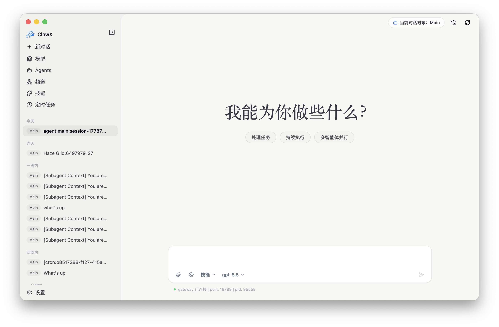

<p align="center">
  
</p>

<h1 align="center">mclaw</h1>

<p align="center">
  <strong>面向地铁行业的图形化 AI 桌面助手</strong>
</p>

<p align="center">
  <a href="#核心特性">核心特性</a> •
  <a href="#三端架构">三端架构</a> •
  <a href="#下载安装">下载安装</a> •
  <a href="#快速开始">快速开始</a> •
  <a href="#开发">开发</a>
</p>

<p align="center">
  
  
  
  
  <a href="https://github.com/nidao003/mclaw/releases"></a>
  
</p>

<p align="center">
  <strong>简体中文</strong>
</p>

---

## 项目简介

**mclaw** 是基于 [OpenClaw](https://github.com/OpenClaw) 二次开发的图形化 AI 桌面助手，专为**地铁行业**场景定制。把命令行 AI 编排能力，转化成开箱即用的桌面体验——无需终端、无需配置文件。

地铁行业核心能力：
- 📊 **地铁数据查询 Skills**：内置站点客流、人口、画像、商业、产业等数据查询技能（车站中心 800 米半径口径），支持 18 类查询，对接 mclaw Go 后端数据接口
- 🔐 **云端模型访问绑定加固**：云端大模型只能在 mclaw 客户端内使用（HMAC 签名 + runtime key 时效），防止白嫖
- 💰 **会员计费体系**：三档套餐 × 日/周/月 token 配额，1 积分 = 1 万 token，auto 智能模型路由
- 🎯 **品牌定制**：地铁橙 #EE7C4B，菜单两字化（对话/模型/专家/任务/技能/链接/图像/梦境）

底层 OpenClaw 能力全部保留：多 AI 提供商接入、技能/插件系统、定时任务、多通道管理、安全凭证存储（系统原生 keychain）。

---

## 截图

<p align="center">
  
</p>

<p align="center">
  
</p>

<p align="center">
  
</p>

<p align="center">
  
</p>

---

## 核心特性

### 📊 地铁数据查询
内置 4 个数据查询技能（query-service / station-profile / data-fusion / query-guide），覆盖 18 类查询：
- 车站：搜索、画像、人口、标签、业态、产业
- 城市：概览、线路、站点、客流（月度/年度/峰值）
- 线路：详情、站点列表
- 业态：配套汇总、POI 详情检索

数据 API key 在 mclaw 内自动注入（存 macOS Keychain，明文不落配置文件），用户无感；也可导出在别处使用。

### 🔐 安全加固
- **云端模型绑定**：客户端 HMAC 签名（X-Mclaw-Sig），deviceSecret 存 keychain，纯 curl 拿 key 算不出签名 → 防白嫖
- **runtime key 时效**：24h 过期 + 可撤销，桌面端启动续签
- **数据 key 隔离**：数据查询 key 与大模型 runtime key 是两套隔离体系，互不影响

### 💬 智能对话
现代聊天界面，支持多会话上下文、消息历史、Markdown 富文本渲染（GitHub 表格、KaTeX 数学公式）、`@agent` 多代理路由。

### 🧩 技能系统
本地优先的技能管理，预装文档处理技能（pdf/xlsx/docx/pptx）、数据查询技能等。支持从技能市场安装扩展。

### ⏰ 定时任务
Cron 自动化，定义触发器、设置周期，AI 代理 7×24 自动工作。

### 📡 多通道管理
同时配置监控多个 AI 通道，每个通道独立运行，支持多账号、按账号绑定代理。

### 🌙 自适应主题
浅色/深色/跟随系统，自动适配。

---

## 三端架构

mclaw 是三端协同的完整产品：

| 端 | 路径 | 技术栈 | 角色 |
|----|------|--------|------|
| **mclaw 桌面端** | `src/` + `electron/` | Electron + React 19 + Vite 7 | mclaw 主应用（连接 Go 后端登录，底层 OpenClaw 服务） |
| **Web 管理后台** | `apps/web/` | React 19 + Vite 7 + Tailwind 3 | 管理端（用户/模型/计费/技能管理） |
| **Go 后端** | `backend/` | Go 1.25 + Ent ORM + Echo | API 服务（支撑桌面端：登录/计费/模型/数据/钱包） |

### pnpm Workspace

```
mclaw/
├── .                    # 主项目（桌面端）
├── apps/web             # Web 管理后台
├── packages/shared      # 共享层（types/api/components/hooks/stores）
├── packages/cli         # CLI 工具
└── harness              # 测试 harness
```

### Go 后端 biz 模块

计费(billing)、钱包(wallet)、订阅(subscription)、LLM 代理(llmproxy)、用户(user)、技能(skill)、专家(expert)、任务(task)、文件(file)、团队(team)、支付(payment)、通知(notify) 等。

---

## 下载安装

### 系统要求

- **操作系统**：macOS 11+、Windows 10+、或 Linux（Ubuntu 20.04+）
- **内存**：4GB 起步（推荐 8GB）
- **存储**：1GB 可用空间

### 预编译包（推荐）

从 [Releases](https://github.com/nidao003/mclaw/releases) 下载对应平台安装包：

| 平台 | 文件 |
|------|------|
| macOS (Apple Silicon) | `mclaw-*-mac-arm64.dmg` |
| macOS (Intel) | `mclaw-*-mac-x64.dmg` |
| Windows | `mclaw-*-win-x64.exe` |

### 安装注意事项

- **macOS**：首发版本未签名，首次打开提示"无法验证开发者"→ 右键应用 → 打开；或终端执行 `xattr -cr /Applications/mclaw.app`
- **Windows**：SmartScreen 可能拦截 → "更多信息" → "仍要运行"

---

## 快速开始

首次启动 mclaw，**设置向导**会引导你完成：
1. **语言地区**：配置偏好语言
2. **登录**：使用 mclaw 后端账号登录（连接 Go 后端）
3. **云端模型**：自动同步已授权的云端模型
4. **数据查询**：登录后自动配置数据 API key，即可在对话中使用数据查询技能

登录后即可在对话中直接提问地铁数据，例如：
- "五四广场站的整体情况怎么样？"
- "青岛3号线有哪些站？"
- "五四广场站周边有没有星巴克？"

---

## 开发

### 环境要求

- **Node.js**：22+（推荐 LTS）
- **pnpm**：9+
- **Go**：1.25+（后端开发）

### 常用命令

```bash
# 安装依赖
pnpm install

# 开发模式（桌面端）
pnpm dev

# 开发模式（Web 管理后台）
pnpm dev:web

# 构建
pnpm build

# 代码检查 / 类型检查
pnpm lint
pnpm typecheck

# 测试
pnpm test
```

### Go 后端

```bash
cd backend
go build -o server ./cmd/
./server
```

### 技术栈

| 层 | 技术 |
|----|------|
| 桌面运行时 | Electron 40+ |
| UI 框架 | React 19 + TypeScript |
| 样式 | Tailwind CSS 3 + shadcn 风格 |
| 状态管理 | Zustand |
| 构建 | Vite 7 + electron-builder |
| 后端 | Go 1.25 + Ent ORM + Echo |
| 图标 | lucide-react |
| 国际化 | i18next |

### 品牌规范

- 品牌色：地铁橙 `#EE7C4B`（禁止擅自修改）
- 图标：统一用 lucide-react，禁止 emoji 当功能图标
- 菜单命名两字化：对话/模型/专家/任务/技能/链接/图像/梦境

详细设计规范见 `docs/design-spec.md`。

---

## 文档

- 设计规范：`docs/design-spec.md`
- 开发计划：`docs/plans/`
- 部署手册：`docs/deploy.md`、`.claude/skills/mclaw-deploy/`
- 旧版多语言 README（ClawX 时期）：`docs/archive/legacy-readme/`

---

## 致谢

mclaw 基于 [OpenClaw](https://github.com/OpenClaw) 二次开发，继承其 AI 代理运行时能力。感谢 OpenClaw、Electron、React、shadcn/ui、Zustand 等优秀开源项目。

---

## License

[MIT License](LICENSE)。

---

<p align="center">
  <sub>Built for the metro industry</sub>
</p>
